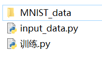
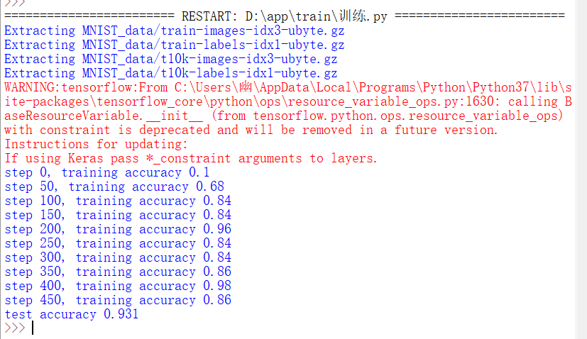
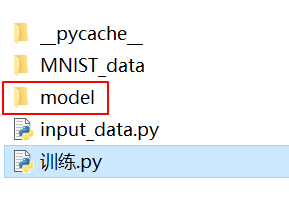
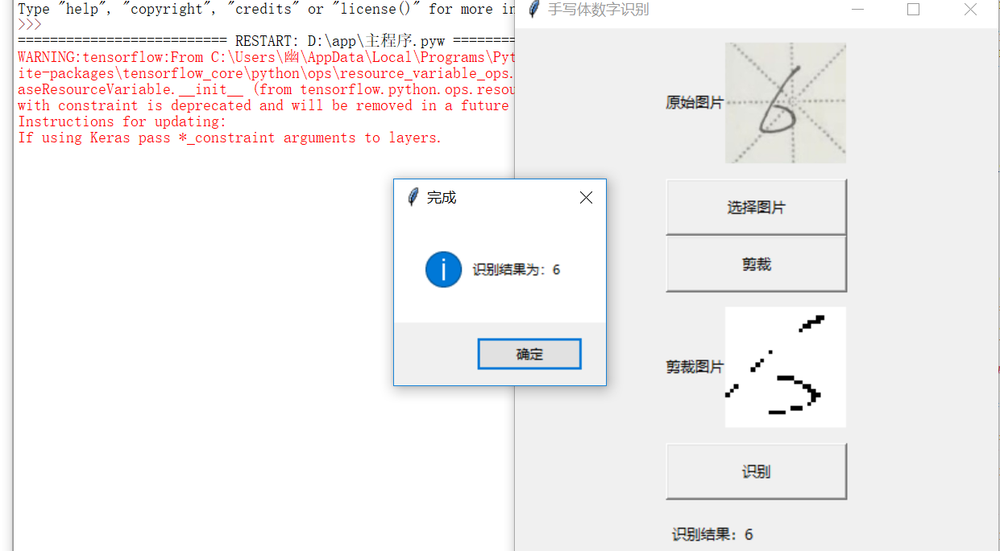

主程序运行需求(其中"example.png"和"cut.png"无具体要求，只要存在即可)  
  
model文件夹需要运行"训练.py"生成  
初始状态  
  
MNIST_data文件夹内容需要下载(http://yann.lecun.com/exdb/mnist/)    
  
运行效果  
  
最终得到  
  
model文件夹内容  
  
主程序成功运行效果  
  
